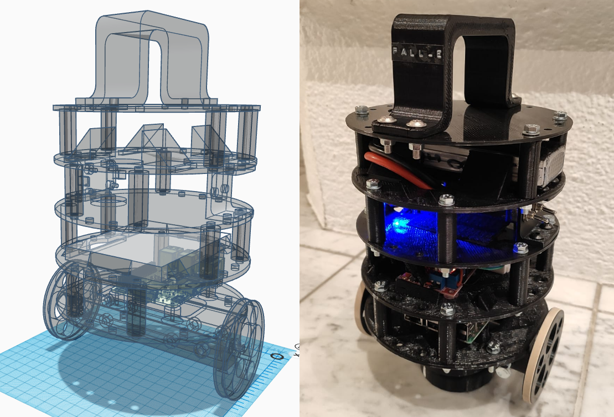
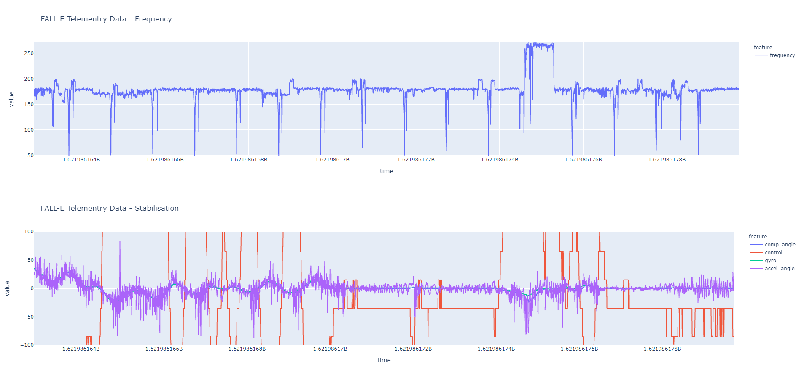
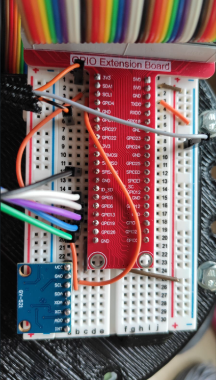

# BalancePiBot - aka FALL-E
A balancing robot build around a Raspberry Pi 3.

## Telemetry Viewer

- Featuring telemetry transmission + viewing 
- Telemetry sent:
    - Angle from complementary filter
    - Angle from Gyroscope
    - Angle from Accelerometer
    - Control from PID algorithm
    - Frequency

## Usage

- Install packages in `requirements.txt`
- Check in `robot.py` variables at the top and see if you want to change something there
    - PID variables for PID tuning (stabilisation)
    - If you like to have logging / telemetry transmission enabled
    - If you want to have telemetry enabled:
        - Set `TELEMTRY_TRANSMISSION` variable in `robot.py` to True
        - Run `telemetry_server.py` within `telemetry` folder
        - Set `SERVER_URL` within `robot.py` to the IP adress + Port (5000) you run the server on (eg.: http://192.168.178.123:5000)
        - The robot will now transmit every `TELEMETRY_BATCH_TIME_SECONDS` its recorded telemetry data
        - Enter your server adress + port to the browser to connect to the telemetry viewer (Note: IF you want to connect locally, use localhost:5000)

## Wiring hints

## Stabilisation

- Stabilisation is done using MPU6050 sensor
- Complementary filter over gyroscope and accelerometer values
- PID algorithm for motor control

## Good 2 Know

Accelerometer: Any kind of linear acceleration, including the orientation of the device because of the acceleration due to gravity from Earth. Can determine rotation to some point due to the sensor itself often isn't in the center of rotation, causing acceleration by centripetal forces. Doesn't work when in the center of rotation, cannot distinguish rotation from acceleration.

Gyroscope: any rotation, unaffected by acceleration.

Magnetometer: orientation and direction by determining the direction of Earth's magnetic field. Can be interfered by the environment, doesn't work everywhere on Earth, potentially useless in a couple of decades due to pole switching.
